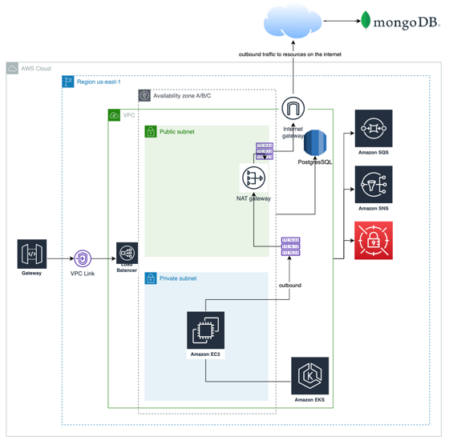
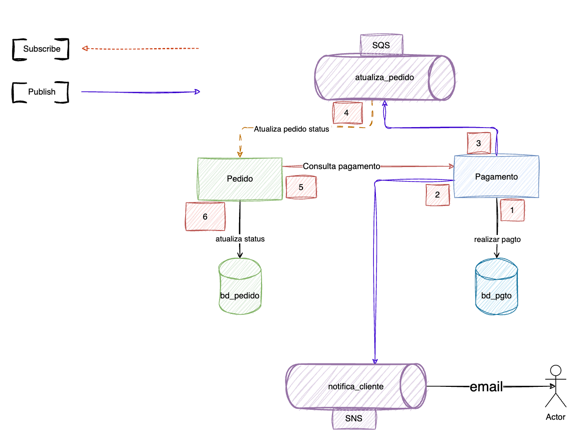

 

<h3 align="center">Microsserviço de Pedidos</h3>

  

    Aplicação criada para o projeto de Pós-Graduação em Arquitetura de software pela FIAP.
     
     
    <a href="https://github.com/PauloLoboNeto/fiappedidos/issues">Report Bug</a>
    ·
    <a href="https://github.com/PauloLoboNeto/fiappedidos/issues">Request Feature</a>
  

  
Tabela de conteúdos

  <ol>
    <li>
      <a href="#Sobre o projeto">Sobre o projeto</a>
      <ul>
        <li><a href="#Construído com">Construído com</a></li>
      </ul>
    </li>
    <li>
      <a>Como executar local</a>
      <ul>
        <li><a href="#Configurar e rodar localmente">Configurar e rodar localmente</a></li>
      </ul>
    </li>
  </ol>

## Sobre o projeto

- Utilizando Arquitetura Hexagonal, conceitos de DDD(https://miro.com/app/board/uXjVMC27TvQ=/?share_link_id=505879927156).

Esta aplicação foi criada por:
- Gabriel Almeida dos Santos, rm430120, gabrielalmeidads@gmail.com
- Paulo Lobo Neto, rm430057, pauloloboneto@gmail.com

(<a href="#readme-top">ir para o topo</a>)

### Construído com

 

[![Docker][Docker]][Docker-url]

 

 

[![Java][Java]][Java-url]

 

 

[![AWS][AWS]][AWS-url]

 

 

[![MONGO][MONGO]][MONGO-url]

 

 

[![INSOMNIA][INSOMNIA]][INSOMNIA-url]

 

(<a href="#readme-top">ir para o topo</a>)

### Configurar e rodar localmente

Para roda essa aplicação, siga os seguintes steps:

1. Instale o [docker](https://docs.docker.com/desktop/?_gl=1*f60bmt*_ga*MTEzMjc4Nzg0NS4xNjkwNjc0MTM0*_ga_XJWPQMJYHQ*MTcxMDY1MjA5MC4xMS4xLjE3MTA2NTIwOTEuNTkuMC4w)
2. Na pasta .aws, altere as credenciais: aws_access_key_id e aws_secret_access_key para as suas credenciais da AWS.
1. Caso você não tenha a fila criada na AWS, o próprio run do projeto irá criá-la automaticamente;
2. Caso queria criar a fila, pode criar duas filas padrões: uma com o nome de StatusChange e outra com o nome de Fila1;
3. Esse step é importante, pois automaticamente quando o container subir, ele irá criar uma fila SQS na sua conta de
   forma automática. Se atente aos custos!
4. As credenciais que você utilizar, precisam ter a permissão de leitura e escrita da fila;
   Caso a fila não exista na sua conta, a credencial precisa ter permissão de criação da fila.
3. Na raíz do projeto, execute o comando: docker compose up
4. Instale o [insomnia](INSOMNIA)
5. Use a collection(insomnia-pagamentos.json) do insomnia que está localizada na raíz desse repositório.
   Ao utilizar a collection, se atente para utilizar o environment "local".
6. O mongoDB está disponibilizado para a aplicação utilizando a plataforma "MongoDB Atlas".
   1. Caso deseje configurar para apontar pra um mongo configurado por você dentro da plataforma atlas, 
   siga essa documentação para criar o banco no atlas: https://www.mongodb.com/pt-br/docs/atlas/;
   2. Dentro do arquivo .env na raíz do projeto, altere as variáveis do mongo de acordo com o que você criou.

### Desenho da arquitetura

### Padrão SAGA utilizado

Coreogradado:
- Utilizamos o padrão coreografado para promover uma arquitetura mais descentralizada,
  onde cada serviço tem autonomia para gerenciar seu próprio fluxo de transações,
  reduzindo a dependência de um componente centralizado.
- Os serviços se comunicam diretamente entre si para coordenar as transações,
  sem depender de um componente central. Isso reduz o acoplamento entre
  os serviços e pode facilitar a evolução independente de cada serviço ao longo do tempo.

Interação entre pagamento e pedido:

Interação entre pedido e fila de pedidos:

<!-- MARKDOWN LINKS & IMAGES -->
[Java]: https://img.shields.io/badge/Java-0769AD?style=for-the-badge&logo=java&logoColor=white
[Java-url]: https://www.java.com/pt-BR/

[Docker]: https://img.shields.io/badge/Docker-2496ED?style=for-the-badge&logo=docker&logoColor=white
[Docker-url]: https://www.docker.com/

[AWS]: https://img.shields.io/badge/AWS-ffa500?style=for-the-badge&logo=AWS&logoColor=orange
[AWS-url]: https://docs.aws.amazon.com/?nc2=h_ql_doc_do&refid=2ee11bb2-bc40-4546-9852-2c4ad8e8f646

[MONGO]: https://img.shields.io/badge/MONGO-008000?style=for-the-badge&logo=MONGO&logoColor=green
[MONGO-url]: https://www.mongodb.com

[INSOMNIA]: https://img.shields.io/badge/INSOMNIA-993399?style=for-the-badge&logo=H2&logoColor=purple
[INSOMNIA-url]: https://insomnia.rest/download